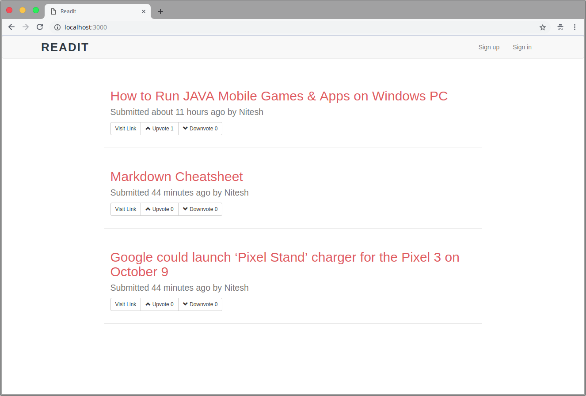
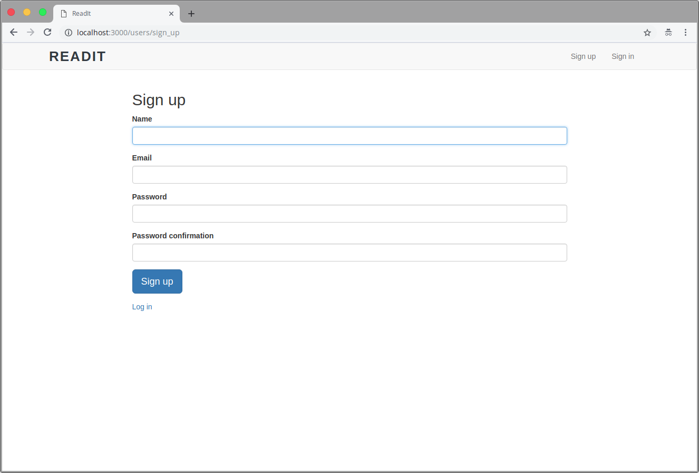
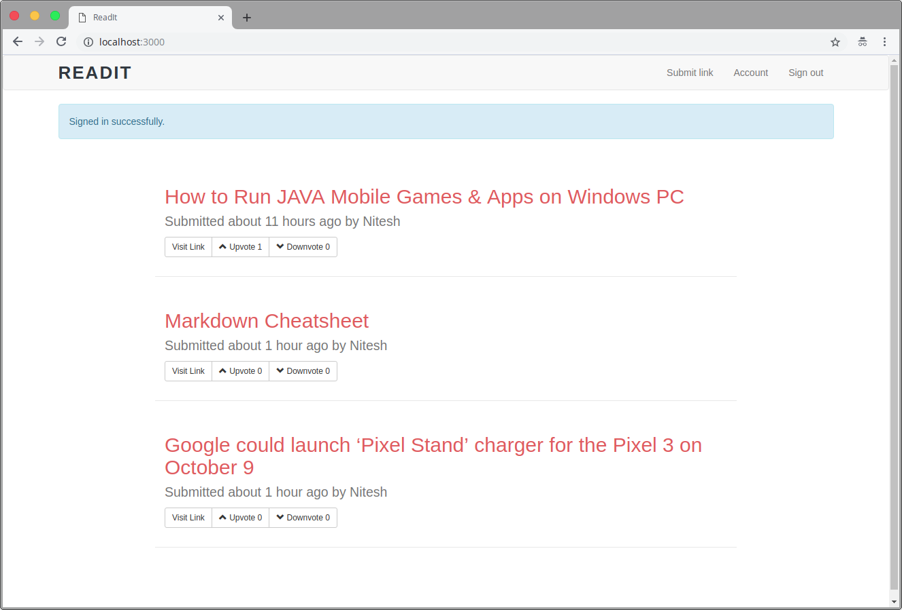
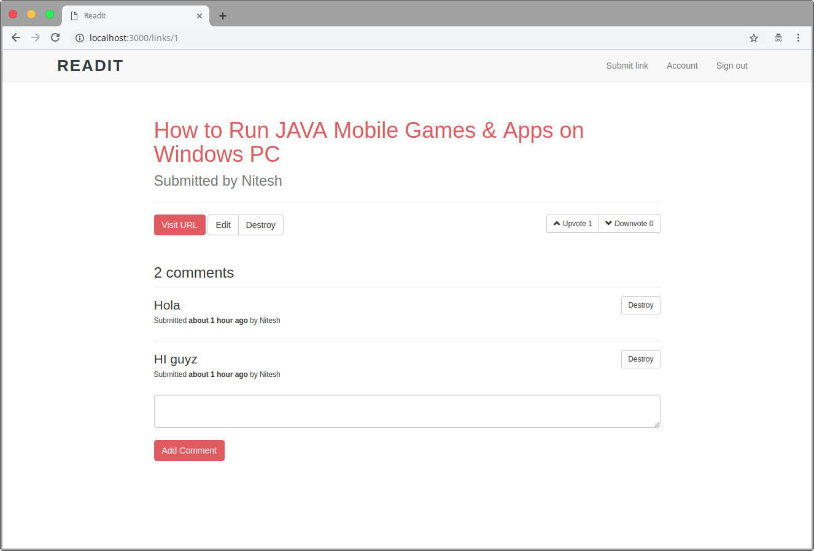

# ReadIt - A Reddit Clone

## Screenshots










* Ruby version used: 2.5.1

* How to test the project

*Open your terminal*

```$ git clone https://github.com/nitesh-prasad/reddit-clone.git
$ cd reddit-clone
$ bundle install
$ bundle exec rake db:create db:migrate db:seed
$ rails s
